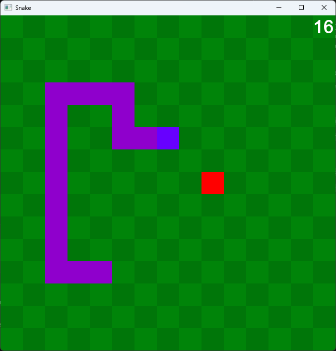

#  Snake in C++ 🐍

The classic game built using C++ and SFML 3.0.2.

[](https://github.com/Mellenker/snake/releases/latest)
[](https://github.com/Mellenker/snake/releases)



## Build from source
#### Prerequisites
* CMake version 3.28 or higher
* CMake generator:
    * Ninja (All major platforms)
    * Visual Studio (Windows only)
* C++17-compliant compiler (or newer):
    * GCC or Clang for Ninja
    * MSVC for Visual Studio
* SFML (fetched automatically by CMake, no manual installation required)

**Note:** Your current working directory must be the project directory for the following commands to work.

### Ninja

```
cmake -B build/ninja-multi -G "Ninja Multi-Config
```
```
cmake --build build/ninja-multi --config Release
```

### Visual Studio
```
cmake -B build/vs2022 -G "Visual Studio 17 2022"
```
```
cmake --build build/vs2022 --config Release
```
## Controls
- **WASD** — Move the snake
- **Enter** — Confirm / Select

## Future feature ideas
* Main menu
* Highscores table
* Sound effects
